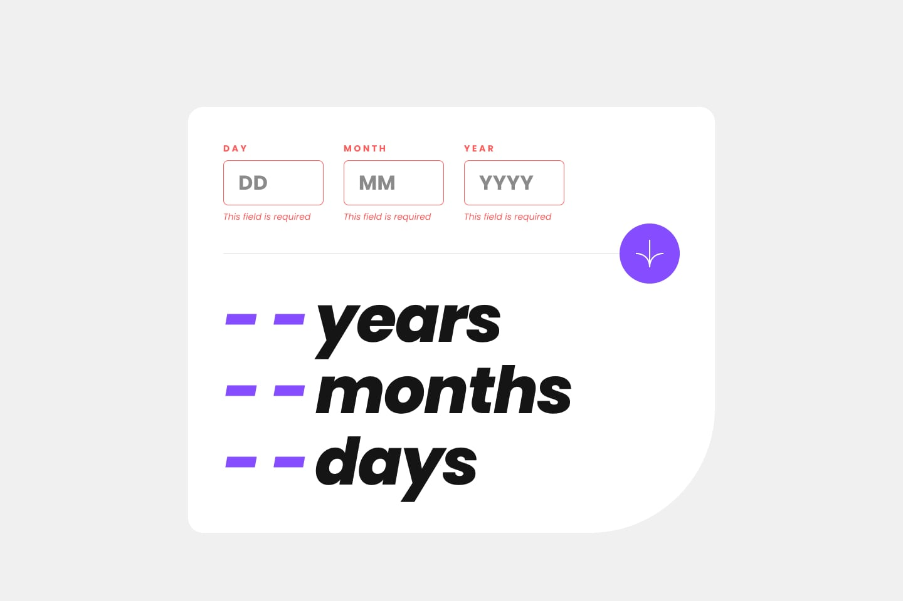

# Age calculator app

<table>
  <tr>
    <td>
      <h3> Desktop preview </h3>
      
    </td>
  </tr>
</table>
<table>
  <tr valign="top">
    <td width="75%">
      <h3> Desktop design </h3>
      
    </td>
    <td>
      <h3> Mobile design </h3>
      
    </td>
  </tr> 
</table>
<table>
  <tr valign="top">
    <td width="33.33%">
      <h3> Desktop error empty </h3>
      
    </td>
    <td width="33.33%">
      <h3> Desktop error invalid </h3>
      
    </td>
    <td width="33.33%">
      <h3> Desktop error whole form </h3>
      
    </td>
  </tr> 
</table>
<table>
  <tr valign="top">
    <td width="50%">
      <h3> Desktop completed </h3>
      
    </td>
    <td>
      <h3> Active states </h3>
      
    </td>
  </tr> 
</table>
