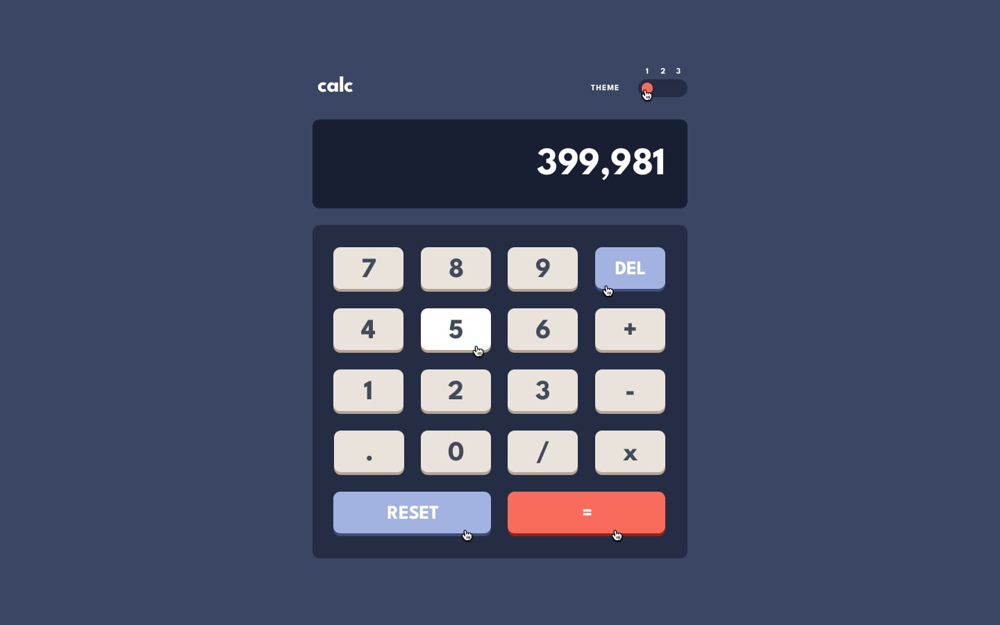

# Calculator app

<table>
  <tr>
    <td>
      <h3> Desktop preview </h3>
      
    </td>
  </tr>
</table>
<table>
  <tr valign="top">
    <td width="50%">
      <h3> Desktop design theme (1) </h3>
      
    </td>
    <td>
      <h3> Active states theme (1) </h3>
      
    </td>
  </tr> 
</table>
<table>
  <tr valign="top">
    <td width="50%">
      <h3> Desktop design theme (2) </h3>
      
    </td>
    <td>
      <h3> Active states theme (2) </h3>
      
    </td>
  </tr> 
</table>
<table>
  <tr valign="top">
    <td width="50%">
      <h3> Desktop design theme (3) </h3>
      
    </td>
    <td>
      <h3> Active states theme (3) </h3>
      
    </td>
  </tr> 
</table>
<table>
  <tr valign="top">
    <td width="33.33%">
      <h3> Mobile design theme (1) </h3>
      
    </td>
    <td width="33.33%">
      <h3> Mobile design theme (2) </h3>
      
    </td>
    <td width="33.33%">
      <h3> Mobile design theme (3) </h3>
      
    </td>
  </tr> 
</table>
